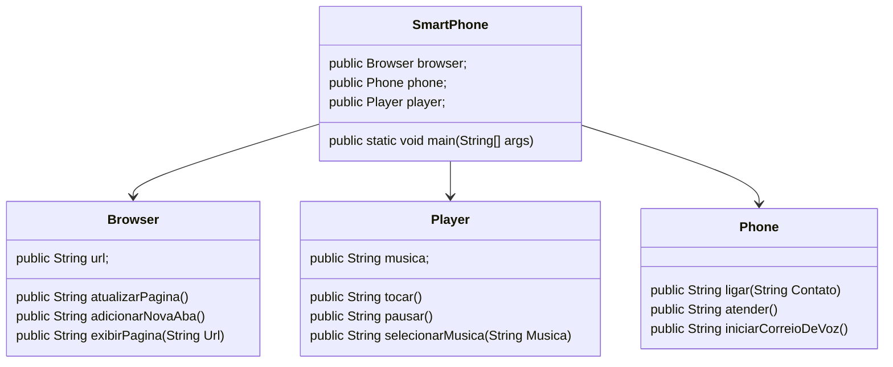

# UML - Iphone
## multipla funcionalidade de Dispositivo Inteligente

### Representação por meio de diagrama UML
Funcionalidades a Modelar

    Player
        Métodos: tocar(), pausar(), selecionarMusica(String musica)
    Phone
        Métodos: ligar(String numero), atender(), iniciarCorreioVoz()
    Browser
        Métodos: exibirPagina(String url), adicionarNovaAba(), atualizarPagina()

Objetivo

    Criar um diagrama UML que represente as funcionalidades descritas acima.
    Implementar as classes e interfaces correspondentes em Java (Opcional).
    

